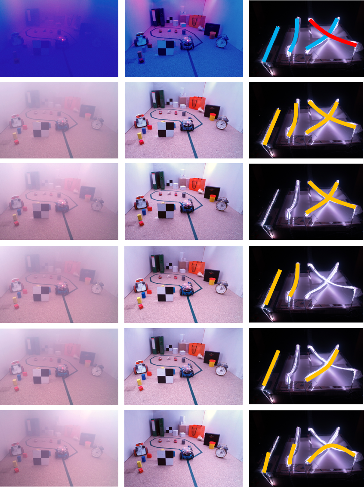

# VIREDA : A new VIdeo REal-world dataset for the comparison of  Defogging Algorithms 

The dataset is available at the following link:

https://doi.org/10.57745/IZKSF9

In the haze folder : 
* 0.015, 0.05, 0.15 correspond to different haze density.
* ec1, ec2, ec3, ec4, ec5, ec6 correspond to six different lighting conditions.

Publication to be referred when using the Vireda database :

Alexandra Duminil, Jean-Philippe Tarel, Roland Brémond. A New Real-World Video Dataset for the Comparison of Defogging Algorithms. 
Advances in Signal Processing and Artificial Intelligence (ASPAI' 2022), Oct 2022, Corfu, Greece. ⟨hal-04220349⟩

https://univ-eiffel.hal.science/hal-04220349

